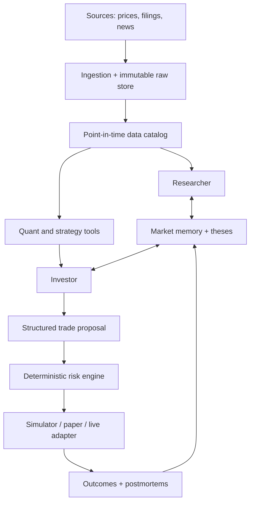
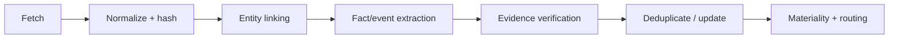
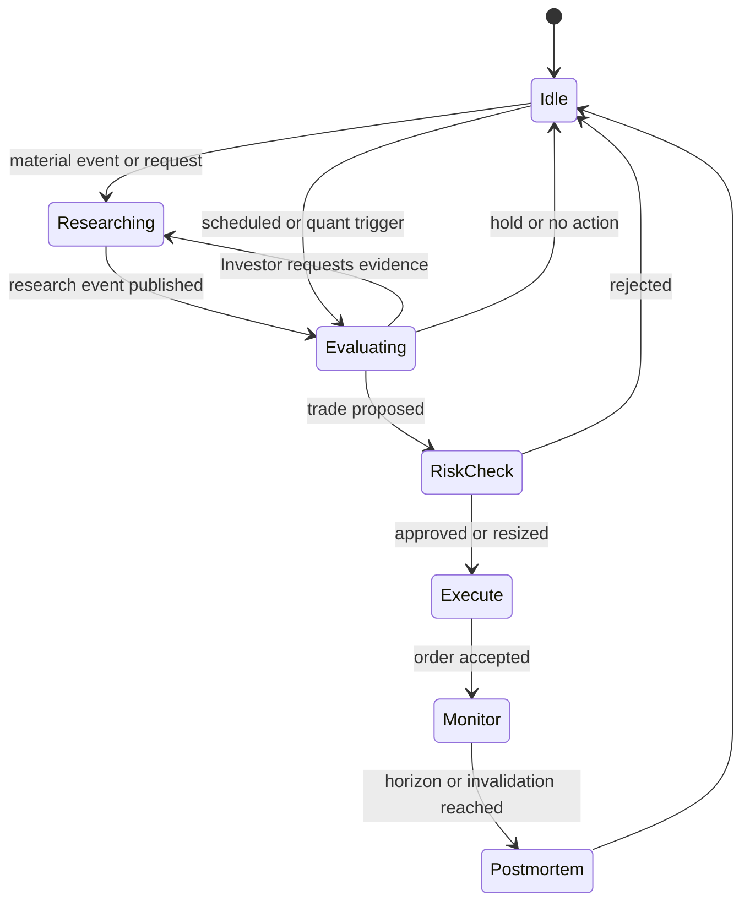

# FinanceBuddy: Implementation Plan and System Architecture

**Status:** Build-ready v1 plan  
**Updated:** September 22, 2026 · shared-core note added September 28, 2026 (§4.2.1)  
**Purpose:** Define a reproducible, staged path from an Investor evaluation lab to a continuously operating research-and-investment system, with paper trading before any live capital.

---

## 1. Product definition

FinanceBuddy is a continuously operating artificial investment organization:

- A **Researcher** converts filings, company releases, news, and requested investigations into timestamped, source-backed market events.
- Quantitative tools convert price, volume, fundamentals, and formalized trading concepts into reproducible signals.
- An **Investor** maintains falsifiable investment theses and emits structured trade proposals.
- A deterministic **Risk and Portfolio Engine** is the only component allowed to approve, size, reject, or route orders.
- An immutable event log makes every decision replayable: what the system knew, which versions ran, why it acted, and what happened afterward.

The agents do not generate an endless conversation. They communicate when an event, question, answer, threshold, or scheduled review changes system state. The UI may render these interactions as a conversation, but the underlying architecture is an event-driven state machine.

### Core research question

> Does persistent interaction between specialized research and investment agents improve time-correct, out-of-sample decision quality relative to equivalently informed single-agent and non-agent baselines?

### Initial scope

These are deliberate product constraints, not claims about the best trading strategy:

- U.S.-listed, liquid equities only
- Long-only positions
- Daily OHLCV bars initially
- End-of-day decisions initially
- Fixed, small ticker universe for engineering tests; point-in-time universes for credible experiments
- Historical replay before real-time data
- No options, leverage, shorting, crypto, or high-frequency execution in v1
- No brokerage credentials in Stages 0–3

---

## 2. Non-negotiable design principles

1. **Time correctness:** Every datum has both an event/publish time and the time FinanceBuddy could first access it. Replay queries may only expose data available at the simulated clock.
2. **Immutable evidence:** Raw bars, filings, news payloads, model inputs, model outputs, prompts, decisions, risk checks, and fills are append-only or versioned.
3. **Structured agent outputs:** Agent decisions must validate against schemas. Free-form prose can explain a decision but cannot directly place a trade.
4. **Deterministic control plane:** Position limits, exposure limits, permitted assets, trading windows, duplicate-order checks, and kill switches are implemented in ordinary code.
5. **Reproducibility:** A run records code commit, dataset snapshot, prompt version, model version, configuration, random seed, and simulated clock.
6. **No silent data leakage:** Splits, feature calculations, corporate actions, universe membership, and news availability are treated as potential sources of look-ahead or survivorship bias.
7. **Evidence before fine-tuning:** Establish a prompt/tool baseline first. Fine-tune only when an error taxonomy shows a stable, trainable failure pattern.
8. **Research and execution are separate:** A convincing thesis can still be rejected by the risk engine.

---

## 3. Stage map and release gates

| Stage | Goal | User-visible result | Exit gate |
|---|---|---|---|
| 0. Experiment contract | Prevent accidental overfitting and moving goalposts | Written protocol, schemas, baseline definitions | Frozen v1 protocol and evaluation configuration |
| 1. Investor Lab | Test strategy reasoning and quantitative tools on historical data | Replay runs, strategy reports, decision ledger | Deterministic replay, leakage checks, baseline comparisons, repeatable results |
| 2. Researcher Lab | Produce time-correct, source-backed market events | Filing/news timeline and research QA reports | Citation coverage, extraction accuracy, deduplication, temporal integrity, query tests |
| 3. Integrated Simulator + UI | Combine Researcher, Investor, quant tools, portfolio, and postmortems | Functional FinanceBuddy dashboard and agent timeline | End-to-end replay; every decision trace reconstructs exactly |
| 4. Live Shadow + Paper | Test real-time reliability without capital | Live paper portfolio and operations dashboard | Predeclared duration and operational/performance gates pass without overrides |
| 5. Restricted Live Capital | Execute under hard limits | Small live account with human oversight | Separate launch review; gradual limits; rapid rollback and kill switch verified |

**Critical rule:** Passing a stage means satisfying its predeclared gate. A profitable-looking chart alone never advances the system.

---

## 4. System architecture



### 4.1 Runtime components

| Component | Responsibility | Recommended implementation |
|---|---|---|
| Web app | Portfolio, theses, event feed, conversations, runs, experiments, controls | Next.js + TypeScript |
| API | Typed read/write API; auth; run controls; UI aggregation | FastAPI + Pydantic |
| Orchestrator/worker | Replay clock, scheduled jobs, agent calls, tool execution, retry policy | Python worker; Redis-backed queue initially |
| Domain core | Portfolio accounting, orders, fills, strategy definitions, risk rules | Pure Python package with no network dependencies |
| Quant engine | Feature generation, backtests, model training/inference, analog search | Python, Polars/Pandas, NumPy, scikit-learn/XGBoost as needed |
| Analytical store | Large historical bars/features and reproducible snapshots | Partitioned Parquet + DuckDB |
| Transactional store | Events, theses, runs, decisions, risk checks, jobs, UI state | Supabase PostgreSQL |
| Raw object store | Original filings, articles where licensed, payloads, charts, model artifacts | Supabase Storage or S3-compatible storage |
| Model gateway | Provider-neutral calls, JSON-schema validation, budgets, retries, caching | Internal Python adapter |
| Execution adapter | Simulator first; paper broker later; live adapter last | One interface with separate implementations |
| Observability | Structured logs, traces, cost, latency, failure and data-freshness metrics | OpenTelemetry-compatible instrumentation |

### 4.2 Why one modular system before microservices

Use one repository and a small number of deployable processes at first. Keep boundaries in code and schemas, but avoid independently deployed services until load or reliability requires them. This preserves fast local iteration while letting the Researcher, Investor, replay engine, and risk engine become separate processes later.

### 4.2.1 Shared core with TradingBuddy (added September 28, 2026)

TradingBuddy is built first and produces `buddycore`: event contracts, the append-only ledger, cash/position/settled-cash accounting with wash-sale flags, the percentage-based deterministic risk engine, a replay clock with a pluggable calendar and bar interval, and the execution adapter interface with a simulator (TradingBuddy plan §3.1). FinanceBuddy's `packages/domain`, `packages/contracts`, and `packages/execution` should **import `buddycore`** rather than reimplement it, adding daily-bar and multi-position concerns on top. Keep storage behind `buddycore`'s interface so FinanceBuddy can use PostgreSQL while TradingBuddy uses SQLite. Reuse does not depend on TradingBuddy's strategy being profitable; it depends only on the core passing its replay, accounting, and risk tests.

### 4.3 Event-driven interaction

Agents wake for explicit triggers:

- a filing or news item passes a materiality threshold;
- a scheduled portfolio review begins;
- price/volume/model state crosses a declared threshold;
- a thesis invalidation condition becomes true;
- the Investor requests a scoped investigation;
- the Researcher returns an answer;
- an order, fill, rejection, or risk breach occurs;
- a holding horizon ends and a postmortem becomes due.

Every trigger creates an event with an idempotency key. Consumers record which event caused their work. Reprocessing the same event must not create a duplicate proposal or order.

---

## 5. Recommended repository structure

```text
financebuddy/
├── apps/
│   └── web/                         # Next.js UI
├── services/
│   ├── api/                         # FastAPI routes and auth
│   └── worker/                      # jobs, replay, agent orchestration
├── packages/
│   ├── contracts/                   # shared JSON Schema / generated TS types
│   ├── domain/                      # portfolio, orders, risk, clocks
│   ├── data/                        # ingestion, point-in-time loaders
│   ├── quant/                       # features, models, strategies
│   ├── agents/                      # researcher/investor/model gateway
│   ├── evaluation/                  # metrics, ablations, reports
│   └── execution/                   # sim, paper, eventual live adapters
├── prompts/
│   ├── investor/
│   └── researcher/
├── configs/
│   ├── experiments/
│   ├── risk/
│   └── universes/
├── data/                            # ignored local cache, not source control
├── notebooks/                       # exploration only; production logic lives in packages
├── tests/
│   ├── unit/
│   ├── integration/
│   ├── replay/
│   ├── leakage/
│   └── golden/
├── infra/
│   ├── docker/
│   └── migrations/
├── scripts/
└── pyproject.toml
```

Use a generated schema pipeline so Python models and TypeScript types cannot drift. The Python package should own financial-domain rules; the UI should never reimplement portfolio accounting or risk logic.

---

## 6. Canonical data model

The exact schema can evolve, but these identities and timestamps should exist from day one.

### 6.1 Market and source data

| Entity | Essential fields |
|---|---|
| `instruments` | `instrument_id`, symbol, exchange, asset type, listing/delisting dates |
| `universe_memberships` | universe version, instrument, `effective_from`, `effective_to`, source |
| `market_bars` | instrument, interval, bar start/end, OHLCV, vendor, adjustment version |
| `corporate_actions` | splits, dividends, mergers, symbol changes, effective date, source |
| `source_documents` | URI, source, title, author, published time, first-seen time, content hash, storage key, license flags |
| `filings` | CIK, accession number, form, filing time, acceptance time, document id |
| `data_snapshots` | snapshot id, covered sources, version/checksum, created time |

### 6.2 Research and memory

| Entity | Essential fields |
|---|---|
| `research_events` | event type, entities, facts, interpretations, materiality, confidence, published/available times, status |
| `evidence_links` | claim id, document id, quoted span or structured locator, entailment status |
| `research_requests` | requesting decision/thesis, question, scope, deadline, status |
| `research_answers` | request id, answer, claims, uncertainty, sources, model/prompt version |
| `theses` | instrument, direction, thesis text, catalysts, counterarguments, invalidation rules, horizon, status |
| `thesis_revisions` | thesis id, prior version, reason, supporting event ids, changed fields |

### 6.3 Strategies, models, and runs

| Entity | Essential fields |
|---|---|
| `strategy_definitions` | stable strategy id, formal conditions, parameter schema, feature dependencies |
| `strategy_versions` | code commit, parameter values, training window, validation window |
| `model_versions` | model family, artifact hash, features, train data snapshot, hyperparameters, metrics |
| `prompt_versions` | role, template, tool set, schema version, content hash |
| `simulation_runs` | config, code commit, snapshot, seed, clock range, status, parent run |
| `agent_invocations` | run, model, prompt, inputs hash, outputs, tool calls, tokens/cost, latency, validation status |

### 6.4 Portfolio and execution

| Entity | Essential fields |
|---|---|
| `decision_cycles` | run, simulated time, trigger event, visible-state snapshot |
| `trade_proposals` | action, instrument, target/maximum size, confidence, thesis, evidence, invalidation, expiry |
| `risk_checks` | proposal, rule version, per-rule result, approved size, rejection reason |
| `orders` | client order id, proposal, mode, type, quantity/notional, limit, status |
| `fills` | order, time, price, quantity, fees, slippage model/observed slippage |
| `positions` | portfolio, instrument, quantity, basis, realized/unrealized P&L |
| `portfolio_snapshots` | cash, equity, exposures, drawdown, holdings, timestamp |
| `postmortems` | decision/thesis, horizons evaluated, expected vs actual, error taxonomy, lessons |

### 6.5 Timestamp rule

Every externally sourced item should support these separately where applicable:

- `event_at`: when the underlying real-world event occurred;
- `published_at`: when the source says it published the item;
- `first_seen_at`: when FinanceBuddy ingested it;
- `available_at`: earliest time the replay engine may reveal it;
- `processed_at`: when a component completed processing.

Replay visibility is based on `available_at`, never on a later-corrected database row or on date-only publication metadata.

---

## 7. Agent and tool contracts

### 7.1 Research Event

```json
{
  "event_id": "evt_...",
  "as_of": "2026-09-22T14:31:00Z",
  "event_type": "filing|earnings|guidance|macro|product|legal|analyst|other",
  "entities": ["NVDA"],
  "facts": [
    {
      "claim": "...",
      "evidence_ids": ["evidence_..."],
      "confidence": 0.96
    }
  ],
  "interpretations": [
    {
      "claim": "...",
      "evidence_ids": ["evidence_..."],
      "confidence": 0.68
    }
  ],
  "materiality": 0.74,
  "affected_thesis_ids": ["thesis_..."],
  "contradicts_event_ids": [],
  "uncertainties": ["..."],
  "source_document_ids": ["doc_..."]
}
```

Facts and interpretations remain separate. A claim without evidence is either rejected by validation or explicitly marked unsupported.

### 7.2 Investor Decision

```json
{
  "decision_id": "decision_...",
  "as_of": "2026-09-22T14:35:00Z",
  "action": "open|increase|reduce|close|hold|no_action|request_research",
  "instrument": "NVDA",
  "thesis_id": "thesis_...",
  "summary": "...",
  "catalysts": ["..."],
  "counterarguments": ["..."],
  "evidence_ids": ["evt_...", "signal_..."],
  "invalidation_conditions": ["..."],
  "horizon": "20_trading_days",
  "confidence": 0.69,
  "requested_target_weight": 0.0125,
  "maximum_acceptable_price": null,
  "expires_at": "2026-09-22T20:00:00Z"
}
```

The Investor requests a target; it never chooses the final approved order size.

### 7.3 Risk Decision

```json
{
  "proposal_id": "proposal_...",
  "risk_policy_version": "risk_v1",
  "status": "approve|resize|reject|manual_review",
  "approved_target_weight": 0.0075,
  "checks": [
    {"rule": "instrument_allowed", "passed": true},
    {"rule": "max_position_weight", "passed": true},
    {"rule": "daily_loss_limit", "passed": true},
    {"rule": "duplicate_order", "passed": true}
  ],
  "reason": "Reduced to satisfy sector exposure limit"
}
```

### 7.4 Initial tool surface

Investor tools:

- `get_portfolio_state(as_of)`
- `get_thesis(instrument, as_of)`
- `get_recent_research(instrument, since, as_of)`
- `get_feature_snapshot(instrument, as_of)`
- `evaluate_strategy(strategy_version, instrument, as_of, horizon)`
- `find_historical_analogs(query, cutoff_time)`
- `request_research(question, scope, deadline)`
- `propose_trade(decision)`

Researcher tools:

- `search_source_catalog(query, cutoff_time)`
- `read_document(document_id, cutoff_time)`
- `get_prior_events(entity, cutoff_time)`
- `get_company_facts(entity, cutoff_time)`
- `compare_periods(entity, metric, periods, cutoff_time)`
- `publish_research_event(event)`
- `answer_research_request(answer)`

All tool calls require an `as_of` or cutoff supplied by the orchestrator. The model cannot advance the clock.

---

## 8. Stage 0: freeze the experiment before coding strategies

### Deliverables

1. `experiment_protocol_v1.md`
2. A machine-readable `experiment_v1.yaml`
3. JSON Schemas for research events, investor decisions, trade proposals, and risk results
4. A data-leakage checklist
5. Predeclared baseline configurations and metrics

### Decisions to freeze for v1

- universe construction and point-in-time membership rules;
- bar interval and decision time;
- adjustment rules for splits/dividends;
- starting cash and cash yield assumption;
- fill price convention and execution delay;
- fees, spread, and slippage assumptions;
- train/validation/test dates and walk-forward procedure;
- benchmark(s);
- strategy-selection budget;
- maximum number of tuning attempts;
- primary and secondary metrics;
- statistical uncertainty/reporting method;
- failure and stage-exit criteria.

The final untouched test interval should not be examined while tuning. Exploratory results should be labeled exploratory; confirmatory runs should use frozen code/configuration except for predeclared fixes.

---

## 9. Stage 1: Investor Lab

### 9.1 What to build

1. **Point-in-time data loader**
   - OHLCV and corporate actions
   - market calendar
   - immutable dataset snapshots
   - a fixed engineering universe, then a historically correct research universe

2. **Replay clock**
   - advances only over known market sessions;
   - exposes data through the current timestamp;
   - forbids direct reads outside the time-filtered data interface;
   - records every visible-state snapshot.

3. **Portfolio simulator**
   - cash, positions, average cost, realized/unrealized P&L;
   - market/limit order lifecycle;
   - configurable latency, spread, slippage, fees, and rejected orders;
   - corporate-action handling;
   - deterministic results from the same seed and inputs.

4. **Strategy registry and DSL**
   - human-readable definition;
   - machine-readable conditions;
   - versioned parameters;
   - required features;
   - expected holding period;
   - falsification criteria.

5. **Investor adapter**
   - receives only time-correct state;
   - calls quant tools;
   - returns schema-valid decisions;
   - supports cached and replayed model responses;
   - tracks model/prompt/tool version and cost.

6. **Evaluation runner**
   - executes variants on identical snapshots and clocks;
   - writes metrics and per-decision traces;
   - supports paired comparisons and ablations;
   - produces an HTML/Markdown report.

### 9.2 First strategy set

Start with five concepts, each given an explicit formula rather than an informal name:

1. Cross-sectional or time-series momentum
2. Short-horizon mean reversion
3. Long-lower-wick rejection (the informal “John Wick” family)
4. Price/volume breakout with confirmation
5. “High slope, low return,” after writing an unambiguous mathematical definition

For each concept, implement:

- a mechanical rule baseline;
- a quant/model score if justified;
- an Investor-accessible tool returning historical evidence and uncertainty;
- positive, negative, boundary, and adversarial tests;
- regime and parameter-sensitivity reports.

Do not let the LLM invent a formula during evaluation. Proposed new variants enter a research queue and receive a new version only after explicit review.

### 9.3 Stage 1 experiment matrix

| Variant | Research input | Quant tools | LLM | Persistent thesis memory |
|---|---:|---:|---:|---:|
| A. Buy-and-hold benchmark | No | No | No | No |
| B. Mechanical strategy | No | Fixed rule | No | No |
| C. Quant ensemble | No | Yes | No | No |
| D. Investor only | Price-derived summary | No | Yes | No |
| E. Investor + tools | Price-derived summary | Yes | Yes | No |
| F. Investor + tools + memory | Price-derived summary | Yes | Yes | Yes |

Use identical timestamps, assets, cost assumptions, and starting portfolios for paired comparisons.

### 9.4 Metrics

Financial outcomes:

- total and benchmark-relative return;
- volatility, Sharpe/Sortino with all conventions declared;
- maximum drawdown and recovery duration;
- turnover, fees, spread/slippage cost;
- hit rate and payoff ratio by horizon;
- gross/net exposure and concentration;
- regime- and strategy-level results.

Decision quality:

- confidence calibration (reliability curve, Brier score where outcome labels are well-defined);
- thesis invalidation precision/recall;
- action stability under semantically irrelevant prompt changes;
- unsupported-claim and tool-misuse rate;
- schema failure, retry, latency, and cost;
- percentage of decisions whose cited evidence was actually visible at decision time.

Robustness:

- walk-forward performance;
- bootstrap confidence intervals;
- sensitivity to costs, delayed execution, and modest parameter changes;
- performance across market regimes;
- results with the best period removed;
- results across multiple universes where data permits.

### 9.5 Fine-tuning decision

Do not fine-tune first. After a meaningful baseline set of decisions:

1. label an error taxonomy;
2. check whether failures are consistent and representation-related rather than caused by missing tools/data;
3. build train/evaluation sets separated by time and underlying episodes;
4. compare prompting/RAG/tool improvements against fine-tuning;
5. fine-tune only if it improves held-out decision-quality metrics without degrading calibration or robustness.

Educational videos and books should become a **concept corpus**. Each item yields definitions, preconditions, counterexamples, and candidate hypotheses. It does not become evidence that the strategy is profitable.

### Stage 1 exit gate

- repeated runs are deterministic except explicitly sampled model behavior;
- all data access passes leakage tests;
- the simulator reconciles cash, positions, orders, and fills exactly;
- all six variants run through the same evaluation harness;
- results include costs, uncertainty, and negative findings;
- at least one complete decision trace is reconstructable from raw data to postmortem;
- the team decides whether any strategy evidence justifies continuing, without retroactively changing the protocol.

---

## 10. Stage 2: Researcher Lab

### 10.1 Source order

Begin with sources that have clear provenance and timestamps:

1. SEC filings and structured company facts
2. Issuer investor-relations releases
3. Earnings materials and transcripts where licensing permits
4. A licensed news feed with historical timestamps
5. Macro releases from official publishers

The SEC provides JSON APIs for submissions and XBRL company facts without API keys and updates those structures throughout the day; automated access must still follow SEC fair-access policies. [SEC EDGAR APIs](https://www.sec.gov/search-filings/edgar-application-programming-interfaces) · [SEC developer resources](https://www.sec.gov/about/developer-resources)

### 10.2 Pipeline



### 10.3 Required behavior

- Preserve the original payload and source metadata.
- Distinguish new events from updates to existing events.
- Attach evidence at claim level.
- Separate facts, source assertions, and model interpretations.
- Mark conflicts and unresolved uncertainty.
- Never summarize a document that was unavailable at the replay timestamp.
- Support Investor follow-up questions with a bounded tool budget.
- Return “insufficient evidence” rather than forcing an answer.

### 10.4 Researcher evaluation set

Build a manually reviewed set of historical episodes containing:

- filing/event identification;
- entity and ticker mapping;
- key fact extraction;
- numerical accuracy and units;
- source entailment;
- materiality ranking;
- duplicate/update classification;
- contradiction detection;
- answer completeness;
- temporal availability.

Evaluate extraction and retrieval independently from downstream trading performance. A Researcher can be correct even if the stock moves in the opposite direction.

### Stage 2 exit gate

- every material factual claim has resolvable evidence;
- time-travel tests prevent post-event information from leaking into historical episodes;
- numerical/unit errors, unsupported claims, and duplicate events are measured;
- the Researcher can answer scoped Investor requests and explicitly abstain;
- source licensing and retention rules are represented in metadata and respected by storage/UI.

---

## 11. Stage 3: Integrated FinanceBuddy simulator and UI

### 11.1 Orchestration state machine



Set hard loop limits: maximum researcher-investor rounds per trigger, maximum tool calls, maximum elapsed time, and maximum model cost. When a limit is hit, the cycle ends as `incomplete`, `abstain`, or `manual_review`; it does not silently continue.

### 11.2 UI pages

1. **Overview:** equity curve, benchmark, cash/exposure, drawdown, open theses, alerts
2. **Timeline:** Researcher/Investor interactions projected from events, with filters
3. **Theses:** active, invalidated, closed; evidence graph and revision history
4. **Portfolio:** positions, attribution, orders, fills, risk use
5. **Decision trace:** visible inputs → tool calls → reasoning summary → proposal → risk checks → execution → outcome
6. **Research inbox:** new events, materiality, conflicts, source coverage
7. **Strategy lab:** definitions, versions, backtests, sensitivity, regimes
8. **Experiments:** variants, configs, paired results, frozen test status
9. **Operations:** source freshness, failed jobs, schema failures, model cost/latency, kill switches
10. **Settings:** universes, model budgets, risk policies, data-source state; immutable changes create versions

### 11.3 API surface

Suggested route groups:

```text
GET  /v1/portfolio/snapshot
GET  /v1/positions
GET  /v1/orders
GET  /v1/theses
GET  /v1/theses/{id}/history
GET  /v1/events
GET  /v1/decisions/{id}/trace
GET  /v1/strategies
POST /v1/simulations
POST /v1/simulations/{id}/pause
POST /v1/simulations/{id}/resume
GET  /v1/simulations/{id}/metrics
POST /v1/research/requests
GET  /v1/operations/health
POST /v1/operations/kill-switch
```

Mutating endpoints use idempotency keys and write audit events. Simulation runs never overwrite prior run results.

### Stage 3 exit gate

- an entire historical interval runs unattended;
- Researcher ↔ Investor follow-ups are bounded and persisted;
- proposals cannot bypass risk checks;
- UI values reconcile against the portfolio ledger;
- any decision can be replayed from an immutable snapshot;
- failure injection confirms recovery from model timeouts, malformed responses, stale data, duplicate events, and worker restarts.

---

## 12. Stage 4: live shadow and paper trading

### 12.1 Two parallel modes

- **Shadow:** consume live data and make decisions, but create no broker orders.
- **Paper:** route approved orders to a simulated brokerage environment.

Keep separate portfolios and ledgers so results cannot be conflated. Alpaca documents a real-time paper environment and exposes separate paper order endpoints, making it one plausible adapter; paper behavior still does not reproduce every live-market effect. [Alpaca paper trading](https://docs.alpaca.markets/us/docs/paper-trading) · [Alpaca order API](https://docs.alpaca.markets/us/reference/postorder)

### 12.2 Operational requirements

- market/data-source freshness monitors;
- clock/calendar reconciliation;
- websocket reconnect and backfill logic;
- order idempotency and broker reconciliation;
- partial fills, cancels, rejects, and stale orders;
- stale-price and stale-research blocks;
- daily ledger reconciliation;
- explicit degraded modes;
- alerting and one-action kill switch;
- secrets stored outside prompts, logs, and source control;
- model/data/broker outage runbooks.

### 12.3 Predeclare paper-trading gates

Before beginning, freeze:

- minimum observation duration and number of independent decisions;
- uptime and data-freshness target;
- maximum unreconciled-order count (ideally zero);
- maximum schema/agent failure rate;
- drawdown and loss-stop behavior;
- cost and turnover constraints;
- required manual review outcomes;
- criteria for extending the test rather than launching.

Do not choose these thresholds after seeing the results.

---

## 13. Stage 5: restricted live capital

This stage requires a separate design and launch review. It is not an automatic code/configuration switch.

### Minimum controls

- separate live credentials and account;
- live mode disabled by default and impossible to activate through an LLM tool call;
- narrow allowlist of symbols and order types;
- hard maximum per-position, sector, gross, and daily notional limits;
- daily loss and drawdown circuit breakers;
- limit-price and stale-price checks;
- duplicate-order and runaway-loop protection;
- human confirmation initially;
- broker-state reconciliation before every new order;
- tested cancel-all and disable-trading action;
- alerts for every live proposal, approval, order, fill, reject, and breach;
- immutable audit records and routine review.

Start with capital whose full loss would be acceptable. Increase limits only through a reviewed configuration version after sufficient live evidence. The Investor never receives brokerage secrets or a direct execution tool.

---

## 14. Deterministic risk engine

Risk rules should be composable pure functions over a portfolio snapshot, proposal, market snapshot, and policy version.

Initial rule categories:

- allowed instrument/universe;
- market session and data freshness;
- maximum order notional;
- maximum position weight;
- maximum sector/industry exposure;
- maximum gross/net exposure;
- cash and buying-power availability;
- liquidity/volume participation limit;
- maximum spread or price deviation;
- thesis and evidence completeness;
- proposal expiry;
- daily turnover limit;
- daily loss/drawdown circuit breaker;
- duplicate/conflicting open order;
- cooldown after repeated losses or operational failures;
- manual-approval requirement by mode.

Every rule emits a pass/fail result, observed value, configured threshold, and explanation. Risk policies are versioned; historical checks always retain the policy version used at decision time.

---

## 15. Testing strategy

### Unit tests

- indicators and feature windows;
- portfolio accounting and P&L;
- splits/dividends;
- risk rules;
- timestamp visibility;
- strategy predicates;
- schema validation;
- idempotency-key generation.

### Property/invariant tests

- cash + marked positions reconcile to equity;
- fills never exceed permitted order quantity;
- replay cannot read rows with `available_at > clock`;
- duplicate events never create duplicate orders;
- closing a position leaves no phantom exposure;
- same snapshot/config/seed produces the same deterministic output.

### Integration tests

- document → research event → Investor → proposal → risk → simulated fill;
- question/answer loop with budget exhaustion;
- queue retries and worker restart;
- broker reconciliation and partial fills;
- database migration compatibility.

### Golden tests

Maintain a small set of frozen historical episodes with reviewed expected Researcher facts, Investor options, risk outcomes, and portfolio accounting. Model prose need not match exactly; schema, evidence, permitted action set, and critical facts must.

### Leakage tests

- deliberately plant future-only sentinel values and assert they are never visible;
- compute features twice, truncating the dataset at the evaluation date, and compare;
- verify point-in-time universe membership;
- verify filing/news `available_at` against source timestamps;
- prohibit global normalization fit on future observations;
- record and test every join direction and tolerance.

---

## 16. Observability and auditability

Every decision cycle should have one trace id linking:

1. triggering event;
2. simulated/live clock;
3. visible data snapshot;
4. prompts and model versions;
5. tool calls and results;
6. research claims and evidence;
7. thesis revision;
8. proposal;
9. risk results;
10. order/fill or rejection;
11. later evaluation and postmortem.

Operational dashboards should track source freshness, queue lag, job failures, model failures, schema retries, average rounds per decision, token/cost budgets, research citation coverage, unresolved broker differences, and kill-switch state.

Never log secrets, full brokerage credentials, private tokens, or licensed content beyond permitted retention.

---

## 17. What not to build first

- live trading;
- a literal always-generating agent conversation;
- fine-tuning infrastructure;
- a vector database before retrieval requirements demonstrate a need;
- microservices, Kafka, or Kubernetes;
- intraday/tick execution;
- options, leverage, shorts, or crypto;
- reinforcement learning from portfolio return;
- dozens of strategies;
- social-media ingestion;
- autonomous strategy mutation;
- a polished public UI before decision traces work.

These can become later hypotheses. None are required to answer the initial research question.

---

## 18. First seven build days

### Day 1 — repository and contracts

- initialize monorepo and local Docker environment;
- set up Python/TypeScript formatting, linting, tests, and CI;
- define shared schemas for `ResearchEvent`, `InvestorDecision`, `TradeProposal`, and `RiskDecision`;
- create first database migrations;
- commit `experiment_protocol_v1` draft.

**Done when:** CI validates a Python object and generated TypeScript type from the same contract.

### Day 2 — historical dataset

- ingest one reliable daily-bar dataset for 5–10 symbols;
- ingest a trading calendar and corporate actions;
- write Parquet partitions and snapshot manifest;
- add time-visibility and checksum tests.

**Done when:** a run can request bars “as of” a date without future rows.

### Day 3 — replay engine

- implement simulation clock and event loop;
- create run configuration and immutable run record;
- persist event/decision trace ids;
- add deterministic replay test.

**Done when:** two identical runs generate byte-equivalent deterministic ledgers.

### Day 4 — strategies

- implement momentum and wick-rejection formal definitions;
- add a strategy registry and versioned config;
- write boundary and look-ahead tests;
- generate first mechanical-signal report.

**Done when:** signals can be recomputed from a frozen snapshot with no notebook-only logic.

### Day 5 — portfolio and risk

- implement orders, fills, cash, positions, valuation, and transaction costs;
- implement initial risk rules;
- test rejected, resized, duplicate, and expired proposals.

**Done when:** accounting reconciles for a full replay and no proposal can directly create a fill.

### Day 6 — Investor baseline

- implement provider-neutral model gateway;
- add schema validation, retries, caching, and budgets;
- expose read-only portfolio/feature/strategy tools;
- run Investor-only and Investor+tools variants.

**Done when:** every model decision is versioned, schema-valid, time-correct, and reproducible from stored inputs.

### Day 7 — evaluation report and minimal UI

- compute baseline financial, decision, cost, and failure metrics;
- build a minimal run list and decision-trace page;
- write the first error taxonomy and prioritize week two.

**Done when:** one click opens a decision from trigger through outcome and compares it with a mechanical baseline.

---

## 19. Suggested milestone schedule

These are planning estimates for a focused solo build, not guarantees.

| Milestone | Estimated focused time | Deliverable |
|---|---:|---|
| Stage 0 | 2–3 days | Frozen experiment contract and schemas |
| Stage 1 foundation | 2 weeks | Replay, simulator, data, strategies, baselines |
| Stage 1 Investor experiments | 2–4 additional weeks | Ablations, error taxonomy, robust reports |
| Stage 2 Researcher | 3–5 weeks | Source-backed historical research pipeline |
| Stage 3 integration/UI | 2–4 weeks | End-to-end simulator and operational UI |
| Stage 4 paper operation | At least several weeks; set gate before starting | Live shadow/paper evidence and reliability report |
| Stage 5 | Only after separate review | Restricted-capital launch |

The fastest credible demo is the end of Stage 1: an Investor managing a historical fake portfolio, with formal strategies, exact time controls, a deterministic risk engine, and complete decision traces.

---

## 20. Immediate backlog

### P0 — must exist before serious experiments

- [ ] Experiment protocol v1
- [ ] Shared schemas and generated types
- [ ] Point-in-time data access layer
- [ ] Snapshot/checksum manifest
- [ ] Replay clock
- [ ] Portfolio ledger and simulator
- [ ] Deterministic risk engine
- [ ] Strategy registry
- [ ] Mechanical baselines
- [ ] Investor model gateway
- [ ] Run/decision trace storage
- [ ] Leakage test suite
- [ ] Evaluation report generator

### P1 — Stage 1 completeness

- [ ] Five initial strategies
- [ ] Walk-forward runner
- [ ] Confidence calibration
- [ ] Cost/slippage sensitivity
- [ ] Thesis memory
- [ ] Postmortem generation
- [ ] Minimal experiment/trace UI
- [ ] Error taxonomy and fine-tuning decision memo

### P2 — Researcher and integration

- [ ] SEC ingestion
- [ ] Issuer-release ingestion
- [ ] Licensed historical news source decision
- [ ] Claim-level evidence store
- [ ] Deduplication/update graph
- [ ] Historical research gold set
- [ ] Investor research requests
- [ ] Materiality routing
- [ ] Integrated agent timeline

### P3 — operations and paper trading

- [ ] Live data adapters
- [ ] Shadow portfolio
- [ ] Paper broker adapter
- [ ] Reconciliation
- [ ] Freshness/health alerts
- [ ] Runbooks
- [ ] Kill switch
- [ ] Paper-stage gate document

---

## 21. Decisions still requiring explicit selection

Resolve these during Stage 0; do not let them become accidental defaults:

1. Initial daily-bar vendor and its point-in-time/corporate-action guarantees
2. Engineering universe and credible experimental universe
3. Exact formal definition of “high slope, low return”
4. Decision time and assumed earliest execution time
5. Benchmark and risk-free-rate convention
6. Slippage/spread model
7. Train/validation/test periods and regime labels
8. Model provider(s), temperature/sampling policy, and per-cycle budget
9. Licensed historical/live news source
10. Paper broker choice
11. Stage 4 duration and quantitative/operational gates
12. Whether live execution will require human approval indefinitely or only initially

---

## 22. Recommended first milestone

Build this exact vertical slice before anything else:

> On a frozen historical dataset, FinanceBuddy receives daily information through date **T**, evaluates two formally defined strategies, decides among `open/increase/reduce/close/hold/no_action`, passes every proposed trade through versioned deterministic risk rules, simulates the next-session execution, and produces a complete decision trace and comparison against buy-and-hold and mechanical-strategy baselines.

That milestone proves the foundation. It also exposes whether the Investor adds value before research ingestion, fine-tuning, a complex UI, or real-time infrastructure can hide weaknesses.

---

## 23. External references

- SEC, **EDGAR Application Programming Interfaces**: <https://www.sec.gov/search-filings/edgar-application-programming-interfaces>
- SEC, **Developer Resources**: <https://www.sec.gov/about/developer-resources>
- Alpaca, **Paper Trading**: <https://docs.alpaca.markets/us/docs/paper-trading>
- Alpaca, **Trading API**: <https://docs.alpaca.markets/us/docs/trading-api>
- Alpaca, **Market Data WebSocket Stream**: <https://docs.alpaca.markets/us/docs/streaming-market-data>
- Alpaca, **Create an Order**: <https://docs.alpaca.markets/us/reference/postorder>

Vendor choices are recommendations for implementation speed, not endorsements or evidence of investment performance. Confirm pricing, entitlements, retention rules, and API behavior when each integration begins because those terms can change.
