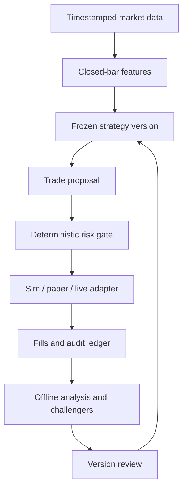

# TradingBuddy: research and implementation plan

**Version:** 1.1 · **Prepared:** September 24, 2026 · **Revised:** September 28, 2026 (Pacific time)  
**Relationship to FinanceBuddy:** This is the intraday research and execution laboratory. Its time-agnostic core (contracts, ledger, accounting, risk engine, replay clock, execution adapters) is built from day one as a package FinanceBuddy can import, not something to port later (§3.1). The longer-horizon FinanceBuddy Investor and Researcher remain separate research questions.

**v1.1 changes:** resolved the conflicting sizing numbers; set risk limits as a percentage of the account; replaced the fixed `SMH` pick with a screen run before testing; added a wick-rejection hypothesis (H2) and a profit-stop decision; chose a cash account; set rules for which data feed each stage uses; added wash-sale tracking; added the v0 scope card (§0.1) and data-collection rules (§5.1).

## 0. The thesis and the honest success criterion

Build a small, replayable intraday trading system for a narrow universe of liquid U.S. stocks or ETFs. The system observes market data, computes a small set of predeclared signals, proposes trades, checks them against a deterministic risk policy, simulates or submits orders, reconciles fills, and records the entire decision. A separate researcher proposes future strategy versions. The production trader cannot alter its own parameters after a loss or bypass risk checks.

**Research question:** Can a fixed, low-complexity intraday strategy generate positive *net* expectancy out of sample, compared with realistic no-trade and simple baselines, without unacceptable losses or operational failures? Only then ask whether adding ML, news, or an LLM improves it.

This is a hypothesis, not a prediction of profitability. Day trading is highly risky; FINRA describes the competition from professional traders and the possibility of losing trading funds [S1]. Backtest selection itself creates false discoveries [P1].

### Separate the three meanings of “$10–20 per day”

| Meaning | Example with $1,000 account | What it implies |
|---|---:|---|
| Daily **deposit** | Add $20 each day | Cash contribution, not a trading return. |
| Daily **position value** | Buy $20 of stock | A 1% price move yields about $0.20 before costs. |
| Daily **maximum intended loss** | Risk at most $10 | Requires a larger position and a price based exit; actual loss can exceed the intended cap. |

Doubling a $20 position means earning $20 on $20, or 100%, in one day. It is an unsuitable target for a repeatable stock strategy. If infrastructure costs $2 per trading day, covering it with a $20 position requires $2/$20 = **10% gross daily return before spreads and slippage**. Conversely, on $1,000 deployed capital $2/$1,000 = **0.2% of account value per trading day**. These are arithmetic examples, not expected returns.

**Decision for this project:** “$10–20 per day” means the **maximum daily loss budget** for an eventual live pilot, not a deposit and not a position size. All risk limits are expressed as a percentage of account equity (§4), so the same policy runs unchanged on paper and live. On the policy's 0.5% daily loss cap, a $10–20 daily budget corresponds to a $2,000–4,000 account. Paper work uses a $1,000 simulated account at the same percentages.

**Plain economics: TradingBuddy will not pay for itself at this scale.** A $300 position earning an exceptional 0.2% per day makes $0.60. The paid SIP data tier ($99/month [B1]) costs about $4.70 per trading day; covering that at 0.2%/day requires ~$2,350 fully deployed *every* day, and a sustained 0.2%/day is roughly 65% per year, which is not a realistic planning assumption. Large-sample studies of retail day traders find that very few are persistently profitable after costs [P2, P3]. Treat TradingBuddy as a funded research lab whose returns are measurements. Scaling capital is a later decision that requires months of out-of-sample evidence; it is never a way to make a bad day “cover costs.”

**Initial success:** trustworthy data and accounting, conservative fill assumptions, a complete audit trail, and a forward test. Profit is an observation to evaluate, not a daily quota. Do not increase trade size to make a bad day “cover costs.”

**Why the bot does not “learn from every trade”:** updating parameters after each trade on a small sample fits noise and tends to chase whatever happened most recently, the automated version of revenge trading. Every trade *is* recorded and analyzed (§3, §5), but changes reach production only as a new version that has passed an offline test on data it has not seen. The realistic edge for a small automated trader is behavioral (it never moves a stop, trades too big after a loss, or ignores a halt), so the risk engine matters more than the signal.

### 0.1 v0 scope card (Phases 0–2 only)

This is the whole v0 build. Everything else in this document is reference material for later phases.

| Item | v0 decision |
|---|---|
| Mode | Historical replay only. `live_enabled: false`. Paper submission is not connected. |
| Account model | Simulated **cash account**, $1,000, settled-cash tracking (T+1), whole shares only |
| Instrument | One liquid U.S. ETF chosen by the predeclared screen in §2.1, plus `SPY` as market context only |
| Session | Regular hours; entries 10:00–15:30 ET; flat by 15:55 ET |
| Hypotheses | H1 opening-range breakout, H2 long-lower-wick rejection (§2), each with a declared profit-stop variant |
| Controls | No-trade, time-matched random entry, buy-and-hold over the same window |
| Risk | Percentage limits in §4; one position; long only; no averaging down |
| Data | Minute bars and a trading calendar per §5.1; the holdout period is fetched but kept separate and not analyzed |
| Done when | Deterministic replay, cash/P&L identities balance, cost-stress table, and a validation-period report for H1/H2 versus the controls. The holdout is opened once, after the report is committed. |

## 1. Stock-market concepts you need for this build

| Concept | Plain explanation | Consequence for TradingBuddy |
|---|---|---|
| Stock / ETF | A stock is ownership in a company; an ETF is a fund whose shares trade on an exchange. | Start with unlevered, liquid equities or a sector ETF. No options, shorting, leverage, or thin names in v1. |
| Core session | The NYSE core session is 9:30 a.m.–4:00 p.m. Eastern on regular sessions [M1]. | Use an exchange calendar and `America/New_York`, including holidays and early closes. Never hard-code UTC offsets. |
| Bid / ask | Bid is a buyer's quote, ask is a seller's quote; ask minus bid is the spread [M2]. | A buy followed by a sell can lose roughly one spread without any midprice change. |
| Market / limit order | A market order prioritizes execution, with uncertain price; a limit order specifies the worst acceptable price but may not fill [M3]. | Model missed fills as well as worse fills. “Would have filled at the candle low” is not a valid assumption. |
| OHLCV bar | Open, high, low, close, volume aggregated over a minute. | A bar does not reveal the order of events *inside* that minute or the executable bid and ask. |
| Liquidity / volume | How easily an order can find counterparties. | Filter by spread, quote age, and observed volume, and record when the filter blocks trades. |
| Slippage | Difference between assumed and actual execution price. | Measure arrival-to-fill price on paper/live; stress the historical model. |
| Volatility | Size and variability of price moves. | Use for position sizing and regime reporting, not as proof of a directional signal. |
| Long / short | Long gains if price rises; short gains if price falls but has other risks. | Long-only reduces the initial state space. |
| Realized / unrealized P&L | Closed-trade gain/loss versus current mark-to-market on open positions. | The daily shutdown must use both, plus fees and outstanding orders. |
| VWAP | Volume-weighted average price during a defined session. | Define whether it includes *only completed bars*; the current, unfinished minute is unavailable at a bar-close decision. |
| Alpha / beta | Alpha is residual performance after suitable risk/market exposure is accounted for; beta measures sensitivity to a benchmark. | Profiting on a day when all semiconductor stocks rise is not by itself evidence of a unique signal. |
| Drawdown | Decline from an earlier equity peak. | Record intraday and full-history drawdowns. A loss cap cannot be inferred from closed trades alone. |
| Sharpe | Average excess return divided by its standard deviation, annualized under assumptions. | Intraday trades are correlated; do not claim high statistical confidence from a naive per-trade Sharpe. |

**Illustrative spread calculation:** if a quote is $100.00 bid / $100.02 ask, buying at the ask and immediately selling at the bid loses $0.02 per share. On a $100.02 purchase, $0.02/$100.02 ≈ **0.020%** of notional for the round trip, before additional slippage and fees. On a $100 position, that is approximately two cents. Actual spreads vary; record quotes around each trade. [M2–M3]

**Illustrative position sizing (matches the §4 policy):** the account has $1,000; the policy allows a planned loss of 0.2% ($2) per trade and a maximum position of 30% of equity ($300). Planned entry $100, stop $99.50: a $0.50/share planned loss allows 4 shares ($400) by the loss rule, but the notional cap allows only 3 shares ($300). The gate approves **3 shares**, for a planned loss of $1.50 plus costs. Both caps must be checked; whichever is smaller wins. A stop trigger is not a guaranteed $99.50 sale: a fast move, halt, outage, or missing fill can create a larger loss [R2]. For a $300 position, a 1% price move is approximately $3 before costs; it does not become $10 just because the daily risk budget is $10.

### Account rules are part of the architecture

FINRA says replacement intraday margin standards became effective June 4, 2026, with a broker transition period through October 20, 2027. A broker can therefore still apply its existing pattern-day-trader controls during transition. Alpaca's paper documentation explicitly describes a simulated PDT check below $25,000 [R1, B2]. **Do not assume an under-$25,000 margin account permits unrestricted day trades. Confirm the precise live and paper account behavior with the broker before connecting live credentials.**

A cash account has a different constraint: U.S. stocks and ETFs generally settle T+1, and trading again with unsettled sale proceeds can cause a freeriding violation or restriction. Track *settled cash* separately from displayed buying power [R3–R4]. Paper accounts may not accurately reproduce the intended cash-account rules. This is another reason to define a broker-specific live gate.

**Decision: cash account, whole shares.** A cash account is not subject to pattern-day-trader counts, which fits a small account. The cost is that sale proceeds are unavailable until settlement, so the accounting must block entries funded by unsettled cash. At one position of ≤30% of equity this rarely binds, and the simulator must enforce it anyway. Confirm the broker's cash-account day-trading behavior before the live pilot.

Fractional shares do not remove market-structure rules. Alpaca's dedicated fractional page says fractional day trades count toward day-trade counts; its descriptions of supported fractional order types are internally inconsistent on the same page [B3]. **v0 therefore uses whole shares only**, which is why the instrument screen (§2.1) requires a share price below the notional cap.

**Wash sales:** selling the same ETF at a loss and buying it within 30 days before or after the sale triggers the wash-sale rule, which defers the loss and adjusts cost basis [T1]. An intraday strategy on one instrument will trigger this constantly. The ledger must flag purchases within that 61-day window around each loss sale from day one so tax records can be reconstructed. Get tax advice before the live pilot.

## 2. Decisions for the first experiment

These are **proposed project settings**, not findings that this asset or strategy makes money.

| Decision | v0 setting | Rationale and how to revisit it |
|---|---|---|
| Market | U.S. exchange-listed, unlevered equities/ETFs | Broker support and simpler accounting. |
| Universe | One liquid sector ETF chosen by the predeclared screen in §2.1; `SPY` as market context/benchmark only | A single instrument reduces data and selection bias. The pick comes from mechanical criteria, not from past returns, and is not a buy recommendation. Freeze the ticker and dates in the experiment manifest. |
| Account | Simulated cash account, whole shares, settled-cash tracking | Avoids PDT counts; see §1. |
| Session | Regular hours only; evaluate an initial window such as 10:00–15:30 Eastern | Avoid opening and closing auction mechanics initially; this window is a design choice. Flatten before the session end and report exceptions. |
| Direction | Long or cash | No short locates, short fees, or borrowed funds. |
| Bar resolution | One-minute closed bars; act at the *next* decision point | Latency-aware, feasible with a basic data feed. No claim to high-frequency trading. |
| Entry research | Two predeclared candidates (H1 opening-range breakout, H2 wick rejection) plus no-trade, random-entry, and buy-and-hold controls | Example hypotheses to falsify, not validated edges. At most three registered hypotheses in v0. |
| Profit stop | Primary runs have **no** daily profit stop; each hypothesis gets one registered variant that stops new entries after +1.0% daily equity gain | Stopping after a big win cuts off the best days, which for breakout strategies can be most of the profit. Whether that trade-off helps is an empirical question, so it is tested rather than assumed. |
| Data feed | Research on historical SIP bars if the account is entitled; live shadow/paper on IEX; every run records its feed | See §5.1. Feature thresholds are computed per feed and never shared across feeds. |
| Risk | One open position; configured exposure cap; no averaging down | Keeps failures diagnosable. |
| Learning | Immutable observation log; frozen production version; offline challengers | Separates measurement from tuning. |
| AI | Offline hypothesis and failure-analysis assistant initially | Any LLM signal needs independent ablation to justify latency and cost. |

**Hypothesis H1, written before testing:** for this one ETF, crossing above a 30-minute opening range high on a completed one-minute bar, with a predeclared volume and market filter, may predict positive executable returns over a specified 15–30-minute horizon. You must choose and freeze exact thresholds, exit rules, dates, and costs in `experiment.yaml` *before* opening the final holdout. Also run a simple opposite / randomized-entry control; do not silently replace the rule if it fails.

**Hypothesis H2, written before testing (the video-sourced pattern):** a completed 5-minute bar (built from completed 1-minute bars) with a long lower wick, meaning rejection of lower prices, may predict positive executable returns over the next 15–30 minutes. Starting definition to refine and then freeze in `experiment.yaml`: lower wick ≥ 2× body and ≥ 60% of bar range; close in the upper third of the range; bar low at or below the session VWAP of completed bars; bar range ≥ a minimum percentile of recent ranges so tiny doji bars don't qualify. Enter on the next observation, stop just below the wick low, exit at a fixed horizon. The prior is weak: a well-known study of candlestick rules on large U.S. stocks found no value after costs [P4]. That makes H2 a good test of the pipeline for turning video claims into tests (§7), and a clean negative result is still a valid outcome.

**Registration limit:** v0 tests H1, H2, and one profit-stop variant of each. Any new idea goes into the claims notebook (§7) as a v1 candidate and does not become a v0 threshold tweak.

### 2.1 Instrument screen (run before looking at any returns)

Candidates: liquid U.S. sector ETFs, starting with `SMH`, `SOXX`, `XLK`, `XLF`, `XLE`, `XLV`. Using only price, spread, and data-coverage statistics, never returns or signal results, keep candidates that satisfy all of:

1. Most recent share price ≤ the notional cap (30% of equity, $300 on the $1,000 paper account), so whole shares work.
2. Median quoted spread over the exploration period ≤ a declared threshold (e.g., 2 bps) during 10:00–15:30 ET.
3. ≥ 99% of regular-session minutes present in the research feed over the full sample, and a reported percentage of missing minutes on IEX.
4. Continuous listing across the whole sample with no pending structural changes.

Among the survivors, choose by a rule declared in advance (e.g., highest median dollar volume). Record the screen output, the rule, and the chosen symbol in the manifest. If none pass, raise the paper account size rather than switching to fractional shares.

Potential later candidates include opening-range *fade*, VWAP mean reversion, and event-conditioned momentum. Keep each as a separate registered experiment. “Branch when the market demands it” means an offline proposal followed by a new prospective evaluation, never a discretionary production universe switch after seeing recent losses.

## 3. Architecture and boundaries



The risk gate is the *only* path to an execution adapter. The research component can propose a new strategy artifact but cannot modify a running strategy, sign an order, change credentials, or rewrite risk settings. A live adapter is absent from the executable configuration until an explicit future release.

### 3.1 Shared core with FinanceBuddy

Build the time-agnostic parts as a separate package inside this repo, `src/buddycore/`, which must not import anything intraday-specific:

| In `buddycore` (shared) | In `tradingbuddy` (intraday only) |
|---|---|
| Event contracts (§3 table), IDs, `available_at` rule | Minute-bar features, opening range, wick rules |
| Append-only ledger and run/experiment records | Intraday session windows, flatten-before-close |
| Cash, positions, settled cash, P&L, wash-sale flags | Intraday cost and latency stress parameters |
| Risk engine taking a policy config (percentage limits, allowlist, halts) | `risk_v0.yaml` values |
| Replay clock with a pluggable calendar and bar interval | Minute-bar replay configuration |
| Execution adapter interface plus sim adapter | Paper/live wiring |

Rule of thumb: if FinanceBuddy's daily-bar Investor would need it unchanged, it belongs in `buddycore`. Keep storage behind an interface (SQLite here, PostgreSQL in FinanceBuddy). A test should import `buddycore` with `tradingbuddy` absent to enforce the boundary.

### A practical stack for your background

| Layer | Start with | Why / trigger to expand |
|---|---|---|
| Language/core | Python 3.12+, type hints, Pydantic contracts, `pytest`, `ruff` | One language for time series, simulation, risk, and broker SDK; you already know Python. Pin actual versions in the lockfile. |
| Data | Alpaca historical minute bars and, if allowed by account/feed, quotes; raw JSON/Parquet + DuckDB | Low setup cost; preserve vendor, feed (`iex`/`sip`), adjustment, retrieval time, and checksum. Vendor docs describe adjusted bars and feed limits [B1, B4]. |
| Calculation | NumPy + Polars or Pandas; pure Python state machine | Vectorize indicators; use sequential event processing for orders and cash. Do not assume a vectorized price series is an execution simulator. |
| State | SQLite WAL locally for events/orders; Parquet for bars; later PostgreSQL | Small, inspectable v0; migrate when concurrent workers or hosted UI demand it. |
| Broker | Official `alpaca-py` SDK, `TradingClient(..., paper=True)` for **paper only** | Official SDK supports historical stock data and paper trading [B5]. Keep auth in environment, never in the UI or repository. |
| API/UI | Add FastAPI + Next.js/TypeScript after the core works | Matches your existing stack; UI can display a live state machine and evidence, rather than becoming the source of financial truth. |
| Background jobs | One process with exchange-calendar scheduler and heartbeat; later queue/worker | Avoid Redis, Kubernetes, and always-on agents in week one. |
| CI/deploy | GitHub CI for replay tests; local machine first, then a monitored host | Runtime reliability is a separate gate. Hosting and monitoring costs should be measured, not assumed. |
| Model research | scikit-learn simple baselines first; an LLM only offline | If a model improves a held-out result, document features and inference cost; no fine-tuning from anecdotal videos. |

**Data caveat:** Alpaca Basic provides real-time **IEX** equity data, not a real-time consolidated view of all U.S. exchanges. Its listed paid Algo Trader Plus tier is $99/month and provides broader real-time equity coverage [B1]. A model trained on IEX bars and evaluated on SIP bars can change behavior. Record feed and bar-construction rules in every run; do not quietly combine feeds or assume IEX volume equals full market volume. A paper-only account is described as entitled to IEX data [B2]. Verify historical coverage and data rights for the precise account before pulling a long sample.

### Minimal repository

The existing `TradingBuddy` repository root is the project root; do not create a nested `tradingbuddy/` directory.

```text
TradingBuddy/                  # existing repo root
  README.md
  pyproject.toml
  .env.example                 # names only; no keys
  configs/experiment_v0.yaml
  configs/risk_v0.yaml
  configs/instrument_screen_v0.yaml
  src/buddycore/               # shared with FinanceBuddy (§3.1)
    contracts.py               # Bar, Quote, Proposal, RiskResult, Order, Fill
    clock.py                   # exchange calendar + replay clock
    ledger.py                  # append-only decisions and state transitions
    accounting.py              # cash, settled cash, equity, P&L, wash-sale flags
    risk.py                    # pure deterministic rules, percentage-based
    execution/base.py
    execution/sim.py
  src/tradingbuddy/
    data/alpaca.py             # explicit feed; pagination; raw snapshots
    data/validate.py           # missing/duplicate/outlier checks
    data/screen.py             # §2.1 instrument screen (no return data)
    features.py                # completed-bar only; 5-min bars from completed 1-min
    strategies/opening_range.py
    strategies/wick_rejection.py
    execution/paper.py         # disabled in v0
    reports.py
  tests/test_clock.py
  tests/test_risk.py
  tests/test_sim_fills.py
  tests/test_accounting.py
  tests/test_no_lookahead.py
  tests/test_core_boundary.py  # buddycore imports without tradingbuddy
  tests/test_holdout_guard.py  # exploration code cannot load holdout data
  scripts/fetch_sample.py
  scripts/replay.py
  research/claims.yaml         # video/article claims notebook (§7)
  data/                        # ignored
```

### Essential event contracts

| Record | Fields to store from day one |
|---|---|
| `market_observation` | instrument ID/symbol, feed, event time, bar start/end, exchange timestamp, received time, OHLCV or bid/ask, vendor response hash, adjustment flag |
| `decision` | stable ID, as-of time, run ID, strategy/code/config version, visible-data cutoff/hash, features, hypothesis ID, proposed side/notional/limit/expiry, no-trade reason |
| `risk_result` | decision ID, policy version, checks and values, allowed/denied/downsized, broker cash/exposure snapshot, reason |
| `order_intent` | deterministic client order ID, decision/risk IDs, mode, notional/quantity, type, price constraint, status, submission deadline |
| `broker_order_event` | broker order ID, timestamps, accepted/rejected/partial/filled/cancelled, raw event, sequence/receipt time |
| `fill` | quantity, price, fees, timestamp, quote at decision/submission/fill, slippage, remaining quantity |
| `portfolio_snapshot` | settled/unsettled cash where applicable, reserved cash, positions, realized and unrealized P&L, mark source/age, peak equity, kill state |
| `experiment` | hypothesis, symbol universe, start/end, training/validation/holdout, exact code commit, dataset/feed hashes, parameter attempts, cost and latency model, metrics |

Use UTC internally, keep the exchange-local session date separately, and never show an item to a replay decision before its `available_at`. An event timestamp is not the same thing as the time *your system* received and processed the item.

## 4. Non-negotiable risk and execution behavior

**v0 paper policy, as a percentage of equity at the session open:**

| Limit | % of equity | On the $1,000 paper account | On a $3,000 live account (illustrative) |
|---|---:|---:|---:|
| Max position notional | 30% | $300 | $900 |
| Planned loss per trade | 0.2% | $2 | $6 |
| Daily loss: stop opening positions | 0.5% | $5 | $15 |
| Weekly loss: halt until manual review | 1.5% | $15 | $45 |
| Peak-to-trough system drawdown: halt, requires a new version review | 3% | $30 | $90 |
| Daily profit stop | none in primary runs; +1.0% in the registered variant (§2) | ($10) | ($30) |

Other limits: one open position; whole shares; only settled cash can fund entries; flatten by 15:55 ET; no leverage, shorting, options, or averaging down; a cap on orders per session. Your original −$100 / +$200 stops were sized for a larger account; at these percentages they correspond to a ~$20,000 account and are not appropriate below that. These are conservative **example software settings**, not a promise of a maximum realized loss or individualized financial advice. Configure the exact policy to the real account and broker rules at a separate launch review.

Policy must check *pre-trade* and continuously: symbol allowlist, core-session cutoff, stale or crossed quotes, missing data, trading halt status if available, max spread, buying power and settled funds, requested and pending exposure, per-trade notional, planned stop distance, correlated positions, daily/weekly drawdown, missing heartbeat, and order-count/rate limits. On ambiguity, freeze new entries and alert. Liquidation behavior should be separately specified and tested; “cancel orders” does not close an existing position.

**Risk budget invariant:** `worst_planned_loss = shares × (entry_reference − exit_reference) + estimated_round_trip_cost`; approved shares must satisfy both planned-loss and notional caps. This is a *planning calculation*. A real stop may execute worse or fail [R2]. The gate should include unfilled and partially filled orders when computing exposure, and reconcile broker positions on restart before opening any new trade.

**Daily shutdown sequence:** (1) atomically set `HALTED`; (2) prohibit new entries; (3) fetch and reconcile open orders/positions; (4) cancel pending entry orders; (5) follow the defined policy for exits with status monitoring; (6) write the broker-confirmed final state; (7) require a manual or next-session reset, never an AI self-reset. If the broker is unavailable, keep the system halted, alert the operator, and do not claim the account is flat.

**Idempotency:** stable `client_order_id = hash(strategy_version, session, instrument, decision_id, action)`. Persist the intent before submission. On timeout, query by client ID before retrying. Listen for order updates and reconcile against REST on startup and on discrepancies. Alpaca describes client-provided order IDs and query-by-ID behavior [B6].

**Paper is an integration test, not an execution-quality proof:** Alpaca says its paper simulator does not account for order impact, latency slippage, queue position, regulatory fees, or dividends, and can fill quantities exceeding available quote liquidity [B2]. Maintain a separate shadow account with conservative hypothetical fills alongside broker paper P&L.

## 5. Historical simulation that does not cheat

1. **Freeze the clock:** strategy sees only completed observations with `available_at ≤ decision_time`; decision for bar `t` cannot fill at the open, high, or low of bar `t`.
2. **Data quality:** validate symbol/timezone/session, duplicate and missing minutes, out-of-sequence quotes, zero/negative/crossed prices, exchange halts, split days, timestamp precision, and adjusted-versus-raw price consistency. Fail or flag a run; never interpolate a tradable quote across a gap.
3. **Quote-aware fill if possible:** for a marketable buy, use a subsequent ask plus latency/impact stress; for sale, subsequent bid minus stress. With minute bars alone, use a deliberately conservative next-bar rule and label the unresolved within-bar ambiguity. Non-marketable limits require a model for non-fill/queue position; seeing a bar touch a limit is insufficient proof of a fill.
4. **Multiple cost scenarios:** report gross, quoted-spread cost, additional slippage, broker/regulatory fees if applicable, and infrastructure expense separately. Example sensitivity assumptions of 0/2/5/10 basis points *per side* are experiment parameters, **not observed broker costs**. Calibrate with actual quotes and arrival-to-fill measurements when available.
5. **Whole portfolio:** account for cash, pending orders, partial fills, trading calendar, mark-to-market, end-of-day exits, failure to flatten, and if applicable T+1 settled cash. Mark unresolved positions as a failure case rather than silently discarding them.
6. **Historical universe:** a fixed symbol is acceptable for an engineering experiment, but selecting it today based on how well it performed historically creates selection bias. State how it was chosen and compare with a prospective freeze. Multi-stock historical work later needs point-in-time membership and delisted symbols.
7. **Train / validation / untouched holdout:** pick chronological periods *after inspecting data coverage but before inspecting performance*; for instance 12 months exploration, 3 months validation, 3 months holdout if sufficient consistent data exist. No mixing adjacent observations across overlapping target horizons. Walk forward through additional windows. Record every tried threshold and abandoned idea. If the holdout informs a revision, it is no longer untouched; acquire new future data.
8. **Baselines:** no trade/cash (operational and cost baseline); buy-and-hold during the same eligible window or an explicitly different horizon; mechanical time-matched random entries with identical sizing/exits; one simple moving-average or momentum rule. Compare equivalent exposures and trade frequencies.
9. **Report:** equity curve, daily net return, dollars, median trade, win/loss distribution, average win/average loss, `expectancy = win_rate × avg_win − loss_rate × avg_loss − average_trade_cost`, maximum drawdown, turnover, gross/net/after-infrastructure result, exposure, missed fills, regime and month breakdown, uncertainty interval based on day-level blocks, and all attempted strategies. A 60% win rate says little without loss size and costs.
10. **Counterfactuals and ablations:** disable volume filter; remove market filter; shift signals by one bar to detect leakage; invert side; compare IEX and SIP where legally and technically available; stress latency; replay with cancelled and partial fills. The goal is to discover why the result exists, not maximize the prettiest curve.

**Statistical caution:** many trades on the same market day share the same market shock. Hundreds of trades are not hundreds of independent market regimes. Bootstrap by session or evaluate independent forward periods; report selection count and uncertainty. Bailey and coauthors formalize how selecting the best of many backtests overfits [P1]. No fixed Sharpe cutoff or short positive run proves alpha.

### 5.1 Data collection rules (for any human or coding agent building the dataset)

More data on the same instrument is not the bottleneck; clean, time-correct data and an untouched holdout are. A large, carelessly collected dataset is worse than a small clean one.

**What to collect for v0:**

| Dataset | Scope | Notes |
|---|---|---|
| 1-minute bars, research feed | Screen candidates (§2.1) + `SPY`; ~24 months if available | SIP if the account is entitled to historical SIP; otherwise IEX, stated plainly in the manifest. Raw (unadjusted) and adjusted, both stored. |
| 1-minute bars, IEX | Same symbols, same period | Needed to measure the gap between IEX and SIP before live shadow runs on IEX. |
| Quotes (bid/ask) | Screen candidates, at least a sample of days in each period | Used for the spread screen and fill calibration. If only a sample is feasible, pick the days by a declared rule. |
| Trading calendar | Full period | Holidays and early closes from the exchange calendar library, checked against NYSE [M1]. |
| Corporate actions | Screen candidates | Splits and distributions, to reconcile raw versus adjusted bars. |
| Claims notebook | `research/claims.yaml` | One entry per video/article claim: source URL, date, creator, the claim, entry/exit pseudocode, conditions, expected failure modes, whether forward evidence was shown. Claims are ideas only; nothing in the notebook is a training label. |

At ~390 minutes × ~252 sessions × 2 years, each symbol and feed is roughly 200k bars. The full v0 dataset fits comfortably on a laptop.

**Split before analysis.** Once coverage is known, and before computing *any* return, signal, or indicator statistic, write the exploration / validation / holdout date ranges into `experiment_v0.yaml` and commit. Holdout data is stored under `data/holdout/` with its own manifest. Exploration and validation code must not read it (`tests/test_holdout_guard.py` enforces this). Coverage, missing-minute, and spread statistics may be computed on all periods; returns and signal outcomes may not be computed on the holdout until the validation report is committed.

**Every fetch writes a manifest:** retrieval time (UTC), symbol, feed, date bounds, adjustment, request parameters, record count, checksum, SDK version. Raw responses are never overwritten; a re-fetch creates a new snapshot.

**Coding agents building the dataset must not:** compute or report returns, backtest results, or signal hit rates on any period while collecting data; pick symbols, dates, or thresholds by looking at performance; interpolate missing bars; mix feeds in one series; or commit credentials or data files.

## 6. Phases, deliverables, and release gates

| Phase | Approximate scope | Deliverable | Exit gate |
|---|---|---|---|
| **0. Contract and environment** | First session | Versioned `experiment_v0.yaml` (H1, H2, profit-stop variants, controls, cost scenarios), `risk_v0.yaml` (percentage limits), `instrument_screen_v0.yaml`, project skeleton with the `buddycore`/`tradingbuddy` split, source inventory, ledger contracts, empty `research/claims.yaml` | A second person could tell exactly what signals, feeds, session, cost assumptions, screen rule, and results will be tested. |
| **1. Data and replay** | Next several sessions | Raw and cleaned minute bars per §5.1, instrument screen output, committed date splits, exchange calendar, quality report, replay clock | Every queried feature is derived exclusively from available completed bars; bad/missing data blocks decisions; the holdout guard test passes. |
| **2. Simulator + hypotheses** | Subsequent sessions | Portfolio accounting (settled cash, wash-sale flags), conservative fills, H1 and H2, baselines, validation report, then a single holdout evaluation | Deterministic replay; cash/P&L identities balance; cost stress and untouched holdout clearly reported. |
| **3. Shadow and broker paper** | After Phase 2 | Live data ingestion, shadow decisions, paper adapter, broker reconciliation, alerts | Reconnect/restart/idempotency and kill-switch drills pass; log every decision including no-trades. |
| **4. Research laboratory and UI** | Parallel after core stable | Experiment registry, challenger reports, event timeline, quote-to-fill explorer, researcher that proposes changes | A reviewer can reconstruct any trade from timestamped inputs and versions; AI ablation shows whether AI adds value. |
| **5. Restricted live pilot** | Only after prospective testing and separate launch review | Small live account and incident runbook | Verify broker/account rules, cash/settlement, order types, market data rights, real fills, budget and tax records. Start with explicit human supervision and the smallest practical positions. |
| **6. FinanceBuddy reuse** | Any time after Phase 2 (does not require a profitable result) | FinanceBuddy imports `buddycore`; distinct daily-bar portfolio strategy | Core boundary test passes in both projects; intraday component remains separately measured; no assumption that a day-trading signal improves longer-horizon investing. |

### Predeclared gates for Phase 3 → 5

Do not use a single profit number as a gate. Before starting the prospective paper period, freeze its duration (a proposed minimum of 3 months, ideally longer across varying conditions), version, universe, and criteria. Require: (a) zero unreviewed duplicate orders or unresolved reconciliation mismatches; (b) tested stale-data and disconnect halts; (c) all decisions and rejected trades logged; (d) conservative shadow P&L, after observable execution costs and sensitivity stress, evaluated against the declared baseline; (e) return uncertainty and drawdowns reported honestly; (f) live-specific broker/account constraints verified. These are **proposed project gates**, not a guarantee that a three-month sample establishes a durable edge. Continuing to paper trade is a valid outcome.

## 7. Study curriculum tied to deliverables

| Module | Learn from | Prove comprehension by building |
|---|---|---|
| Orders and market structure | SEC Investor.gov order types [M3], bid/ask [M2], FINRA order/stop guidance [R2] | Explain why a buy at $100.02 and sale at $100.00 loses money with a flat midpoint; code market, limit, partial, reject, cancel states. |
| Sessions, calendars, settlement | NYSE session/holiday page [M1], SEC T+1 and cash-account guidance [R3–R4] | Reproduce an early close and a T+1 settled-cash example; show distinct Eastern session date and UTC event time. |
| Brokerage and data | Alpaca data tiers [B1], historical bars [B4], paper caveats [B2], official Python SDK [B5] | Fetch one symbol with explicit feed and adjustment; save raw payload and manifest; query paper account without sending an order. |
| Strategy research | Read a primary backtest overfitting paper [P1], then the experiment protocol | Register a hypothesis before seeing the holdout and log all parameter searches. |
| Evaluation | Your own daily return and fill data | Report a cost sensitivity table and uncertainty by market day, plus cases where the system intentionally did nothing. |
| Operational engineering | Broker order IDs [B6] and paper simulation limits [B2] | Demonstrate repeated request does not duplicate an order; disconnect and restart reconcile state. |

**How to use videos:** keep a notebook of *testable claims* in `research/claims.yaml` (schema in §5.1): the actual source link and date, entry/exit pseudocode, conditions, expected failure modes, and whether the creator supplied credible forward evidence. A video is an idea source; training for hours on videos does not create labels about future returns. Candle patterns such as the long-wick “John Wick” candle become precise rules (H2 is the template), and each rule is tested as a registered hypothesis. Test only a small registered set so repeated search does not inflate apparent skill; notebook entries wait for v1 unless they replace an existing registration.

## 8. Start today: a four-hour working session

All work in v0 is historical; nothing in this session places an order.

**Hour 0–1: set the contract.** Work in the existing `TradingBuddy` repository root. Write `README.md` with the question from §0 and write `configs/experiment_v0.yaml` with `mode: replay`, `universe: TBD_BY_SCREEN` (filled from §2.1 output), `context: [SPY]`, `bar_interval: 1Min`, `research_feed: sip_or_iex_as_entitled`, `live_feed: iex`, `session_timezone: America/New_York`, `entry_window: 10:00-15:30`, `flatten_by: "15:55"`, hypotheses `H1_opening_range_breakout` (`opening_range_minutes: 30`) and `H2_wick_rejection` (`bar_interval: 5Min`, thresholds from §2), a `profit_stop_variant` per hypothesis, controls, `signal_on: completed_bar`, `earliest_fill: subsequent_observation`, `direction: long_only`, `account_type: cash`, `whole_shares_only: true`, `initial_cash: 1000`, cost-scenario parameters, train/validation/holdout dates once coverage is verified, and a unique version. Add `configs/risk_v0.yaml` with the §4 percentage limits, `mode: replay`, and `live_enabled: false`, and `configs/instrument_screen_v0.yaml` with the §2.1 candidates, criteria, and tie-break rule.

**Hour 1–2: scaffold and learn the data API.** From the repository root:

```bash
mkdir -p configs scripts data/holdout tests research src/buddycore/execution src/tradingbuddy/{data,strategies,execution}
python3 -m venv .venv
source .venv/bin/activate
python -m pip install --upgrade pip
python -m pip install alpaca-py pydantic pandas pyarrow duckdb pytest ruff pyyaml
```

These commands are a starter recipe; pin tested versions and create a lockfile before reproducible runs. Put `data/`, `.venv/`, `.env`, and credentials in `.gitignore`. Save an `.env.example` containing **names only**. Sign up for a paper account if needed, but do not create a live trading credential for this stage. The Alpaca `StockHistoricalDataClient` and `TradingClient(..., paper=True)` are documented in the official SDK [B5].

**Hour 2–3: one clean dataset.** Request a small recent **historical** period for one screen candidate and `SPY` with an explicit feed (full collection follows §5.1) and adjustment, respecting current account entitlements [B1, B4]. Save (a) original response, (b) normalized Parquet, (c) `manifest.json` with retrieval UTC, symbol, feed, date bounds, timezone, adjustment, API request parameters, record count, checksum, and SDK version. Validate uniqueness, minute ordering, exchange session, missing bars, and prices. Do not infer a zero-volume minute is tradable.

**Hour 3–4: a tiny replay and proof.** Implement `ReplayClock.visible_bars(as_of)`, a completed-bar VWAP function, and a `RiskEngine.check(proposal, state)`. On a synthetic four-bar fixture, assert that modifying a *future* bar cannot change an earlier proposal; that a loss-limit breach rejects a buy; and that a repeated decision yields the same client ID. Print a report with data range, missing-minute count, first two decisions, and explicit no-trade reasons. **Stop before connecting paper order submission.**

### Tomorrow's first commit and subsequent milestone

First commit: project contract + source list + validated sample + replay and risk tests. Next milestone: implement cash/position accounting, conservative fill assumptions, and a *no-trade* benchmark before asking whether the breakout idea makes money. If the sample or broker entitlement does not permit a clean minute-bar test, document that obstacle and choose a documented data provider; do not fabricate fill quality from a delayed or partial feed.

## 9. The impressive version, after the core is credible

Build an **evidence-first operations console**, not a trade-button demo: a market clock, data-feed health, a “why no trade?” trace, risk budget and kill state, chart annotated with decision/arrival/quote/fill timestamps, broker-versus-shadow P&L, an experiment registry that displays *all* attempted variants, and a replay slider that reconstructs what the strategy knew. Add a researcher that creates signed candidate hypotheses and an offline evaluator that publishes failure reports. An excellent technical demo shows an attractive signal being **rejected** due to stale data, duplicate intent, or exhausted risk budget, and a challenger losing to a boring baseline in a fair test.

This produces a defensible story even if the trading strategy fails: point-in-time simulation, order-state reconciliation, risk isolation, empirical hypothesis testing, and an auditable research loop. Do not describe a profitable paper period as proof of a future income stream.

## 10. Sources checked September 24, 2026

All monetary and risk-policy examples above are our arithmetic or proposed project parameters unless a linked source explicitly supplies them. Verify changeable broker prices, account permissions, API behavior, and rules again before the relevant phase.

- **[S1]** FINRA, [Day Trading](https://www.finra.org/investors/investing/investment-products/stocks/day-trading) (risks and investor guidance).
- **[M1]** NYSE, [Holidays & Trading Hours](https://www.nyse.com/trade/hours-calendars).
- **[M2]** SEC Investor.gov, [Bid Price/Ask Price](https://www.investor.gov/introduction-investing/investing-basics/glossary/ask-price).
- **[M3]** SEC Investor.gov, [Types of Orders](https://www.investor.gov/introduction-investing/investing-basics/how-stock-markets-work/types-orders).
- **[R1]** FINRA, [Understanding the New Intraday Margin Requirements](https://syndication.finra.org/content/understanding-new-intraday-margin-requirements).
- **[R2]** FINRA, [Stop Orders: Factors to Consider During Volatile Markets](https://www.finra.org/investors/insights/stop-orders-factors-consider-during-volatile-markets).
- **[R3]** SEC Investor.gov, [New “T+1” Settlement Cycle](https://www.investor.gov/introduction-investing/general-resources/news-alerts/alerts-bulletins/investor-bulletins/new-t1-settlement-cycle-what-investors-need-know-investor-bulletin).
- **[R4]** SEC Investor.gov, [Trading in Cash Accounts](https://www.investor.gov/introduction-investing/general-resources/news-alerts/alerts-bulletins/investor-bulletins/updated-9), updated August 7, 2026.
- **[B1]** Alpaca, [About Market Data API](https://docs.alpaca.markets/us/v1.1/docs/about-market-data-api) (free IEX feed and paid broader coverage).
- **[B2]** Alpaca, [Paper Trading](https://docs.alpaca.markets/us/v1.4.2/docs/paper-trading) (simulation limitations and paper PDT behavior).
- **[B3]** Alpaca, [Fractional Trading](https://docs.alpaca.markets/us/docs/fractional-trading) (order types, eligibility, day-trade counts; note inconsistent text on page).
- **[B4]** Alpaca, [Historical bars](https://docs.alpaca.markets/us/v1.1/reference/stockbars) (request time frame and adjustment parameters).
- **[B5]** Alpaca, [Official Python SDK](https://github.com/alpacahq/alpaca-py), including its trading and data examples.
- **[B6]** Alpaca, [Placing Orders](https://docs.alpaca.markets/us/docs/orders-at-alpaca) (client order IDs and order-status queries).
- **[P1]** Bailey et al., [The Probability of Backtest Overfitting](https://papers.ssrn.com/sol3/papers.cfm?abstract_id=2326253) (original research paper).

*Added in v1.1 (September 28, 2026); cited by title, links not re-checked:*

- **[P2]** Chague, De-Losso & Giovannetti, “Day Trading for a Living?” (2019 working paper; Brazilian futures day traders).
- **[P3]** Barber, Lee, Liu & Odean, “The Cross-Section of Speculator Skill: Evidence from Day Trading,” *Journal of Financial Markets* (2014).
- **[P4]** Marshall, Young & Rose, “Candlestick Technical Trading Strategies: Can They Create Value for Investors?,” *Journal of Banking & Finance* (2006).
- **[T1]** IRS, [Publication 550, Investment Income and Expenses](https://www.irs.gov/publications/p550) (wash sales).

